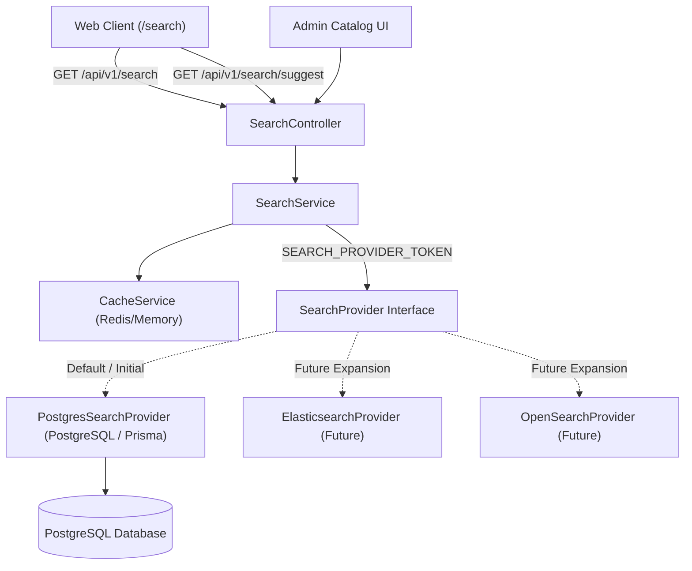

# Product Search Architecture & Multi-Engine Abstraction

> Covers `apps/api/src/search`, `@pc-platform/types`, and frontend search experiences  
> Status: Active | Version: 1.0.0

---

## 1. Architectural Overview & Design Philosophy

The product search system provides fast, multi-faceted hardware discovery across our catalog. Unlike generic e-commerce platforms, PC hardware discovery requires searching across:

1. **Top-Level Catalog Attributes**: Product name, brand, model, SKU, description, tags.
2. **Taxonomy**: Categories (hierarchical or multi-assigned categories).
3. **Deep Hardware Specifications**: CPU socket types, GPU chipsets, motherboard form factors, RAM frequencies/types, power supply wattages, and cooler radiator dimensions.

### Core Architectural Principle

> **Search must remain isolated behind a pluggable `SearchProvider` abstraction.**

Frontend applications (`apps/web`, `apps/admin`), client libraries (`@pc-platform/api-client`), and API controllers (`SearchController`) MUST NEVER depend directly on a concrete database engine or search server (e.g., PostgreSQL, Elasticsearch, OpenSearch, Typesense, or Meilisearch). 

Switching the underlying engine to Elasticsearch/OpenSearch in the future requires **zero changes** to frontend contracts or REST API routes.



---

## 2. The `SearchProvider` Abstraction

Defined in [`apps/api/src/search/interfaces/search-provider.interface.ts`](file:///d:/project/pc-platform/apps/api/src/search/interfaces/search-provider.interface.ts):

```typescript
export const SEARCH_PROVIDER_TOKEN = 'SEARCH_PROVIDER_TOKEN';

export interface FacetBucket {
  value: string;
  label: string;
  count: number;
}

export interface SearchFacets {
  categories: FacetBucket[];
  brands: FacetBucket[];
  componentTypes: FacetBucket[];
  priceRange: { min: number; max: number };
  inStockCount: number;
  specifications?: Record<string, FacetBucket[]> | undefined;
}

export interface SearchOptions {
  query?: string | undefined;
  categorySlugs?: string[] | undefined;
  brandSlugs?: string[] | undefined;
  componentTypes?: string[] | undefined;
  minPrice?: number | undefined;
  maxPrice?: number | undefined;
  inStock?: boolean | undefined;
  sortBy?: ('relevance' | 'price_asc' | 'price_desc' | 'newest' | 'name_asc' | 'name_desc') | undefined;
  page?: number | undefined;
  limit?: number | undefined;
  specs?: Record<string, any> | undefined;
}

export interface SearchResult {
  items: ProductResponseDto[];
  total: number;
  page: number;
  limit: number;
  totalPages: number;
  facets: SearchFacets;
}

export interface SearchSuggestion {
  id?: string | undefined;
  title: string;
  type: 'product' | 'brand' | 'category' | 'spec' | 'query';
  slug?: string | undefined;
  category?: string | undefined;
  price?: number | undefined;
}

export interface SearchProvider {
  search(options: SearchOptions): Promise<SearchResult>;
  suggest(query: string, limit?: number): Promise<SearchSuggestion[]>;
}
```

### Dependency Injection Wiring

In [`apps/api/src/search/search.module.ts`](file:///d:/project/pc-platform/apps/api/src/search/search.module.ts):

```typescript
@Module({
  controllers: [SearchController],
  providers: [
    SearchService,
    PostgresSearchProvider,
    {
      provide: SEARCH_PROVIDER_TOKEN,
      useClass: PostgresSearchProvider, // Configurable via environment in future
    },
  ],
  exports: [SearchService, SEARCH_PROVIDER_TOKEN],
})
export class SearchModule {}
```

---

## 3. PostgreSQL Search Implementation (`PostgresSearchProvider`)

### A. Multi-Field Matching Strategy

When a search term is submitted (e.g., `q = "7800X3D"` or `q = "B650"` or `q = "DDR5"`), `PostgresSearchProvider` builds a dynamic compound `where` clause evaluated across indexed relational tables:

1. **Direct Attributes**:
   - `name`: Case-insensitive substring match (`contains`, `mode: 'insensitive'`)
   - `model`: Substring match
   - `sku`: Substring match
   - `description`: Substring match
   - `tags`: Array membership (`has: term.toLowerCase()`)
2. **Brand & Category Relations**:
   - `brand.name` and `brand.slug`
   - `categories.some.category.name` and `categories.some.category.slug`
3. **Hardware Specifications Relations**:
   - **CPU**: `cpuSpec.socketType`, `cpuSpec.architecture`
   - **GPU**: `gpuSpec.chipset`, `gpuSpec.memoryType`
   - **Motherboard**: `motherboardSpec.socketType`, `motherboardSpec.chipset`, `motherboardSpec.formFactor`
   - **RAM**: `ramSpec.memType`
   - **Storage**: `storageSpec.interface`, `storageSpec.formFactor`
   - **PSU**: `psuSpec.efficiencyRating`, `psuSpec.modular`
   - **Case**: `caseSpec.formFactor`
   - **Cooler**: `coolerSpec.coolerType`, `coolerSpec.supportedSockets`

### B. Structured Specification Filtering

In addition to full-text matching, users can drill down into specific hardware parameters via `specs` key-value pairs (e.g. `specs: { socket: 'AM5', memType: 'DDR5' }`):

- `specs.socket`: Matches across `cpuSpec.socketType`, `motherboardSpec.socketType`, and `coolerSpec.supportedSockets`.
- `specs.chipset`: Matches `gpuSpec.chipset` or `motherboardSpec.chipset`.
- `specs.formFactor`: Matches `motherboardSpec.formFactor` or `caseSpec.formFactor`.
- `specs.memType` / `specs.memoryType`: Matches `ramSpec.memType`.
- `specs.wattage`: Matches `psuSpec.wattage >= targetWattage`.

### C. Dynamic Facet Aggregation

To provide immediate faceted navigation (category distributions, brand counts, active price boundaries, and hardware spec options):

1. Alongside the paginated product query, a lightweight projection query executes with the same matching filter conditions selecting only facet keys:
   ```typescript
   select: {
     id: true,
     componentType: true,
     brand: { select: { id: true, name: true, slug: true } },
     categories: { select: { category: { select: { id: true, name: true, slug: true } } } },
     prices: { where: { isActive: true }, select: { amount: true, priceType: true } },
     inventory: { select: { quantity: true, reservedQty: true } },
     cpuSpec: { select: { socketType: true } },
     gpuSpec: { select: { chipset: true } },
     motherboardSpec: { select: { socketType: true, chipset: true } },
     ramSpec: { select: { memType: true } },
   }
   ```
2. The provider aggregates match distributions:
   - **Category Buckets**: Counts matching products per category slug/name.
   - **Brand Buckets**: Counts matching products per manufacturer.
   - **Component Type Buckets**: Distribution across CPU, GPU, RAM, etc.
   - **Price Range**: Calculates true `min` and `max` active retail prices among matching items.
   - **In-Stock Count**: Number of matching products with positive unreserved stock.
   - **Hardware Spec Buckets**: Distribution of sockets (`AM5`, `LGA1700`), chipsets (`B650`, `Z790`), and RAM types (`DDR5`, `DDR4`).

---

## 4. Autocomplete & Search Suggestions

The autocomplete endpoint (`GET /api/v1/search/suggest?q={term}&limit=8`) provides sub-10ms lookup for search inputs:

1. **Brand Matching**: Returns top brands whose names match the prefix (type: `'brand'`).
2. **Category Matching**: Returns top categories matching the query (type: `'category'`).
3. **Product Matching**: Returns matching products with their active retail price and primary category badge (type: `'product'`).
4. **Dropdown Presentation**: Rendered instantly by `@pc-platform/ui` `SearchInput` component with keyboard navigation and instant selection.

---

## 5. Caching & Performance

Search results and suggestions are wrapped by `CacheService`:

- **Search Results TTL**: 60 seconds. Tagged with `catalog:search` and `catalog:products`.
- **Search Suggestions TTL**: 120 seconds. Tagged with `catalog:search`.
- **Cache Invalidation**: Any product, inventory, or price mutation in `ProductsService` or `AdminProductsService` calls `cacheService.invalidateByTag('catalog:products')` and `cacheService.invalidateByTag('catalog:search')`, ensuring users never see stale search results or out-of-stock items marked as in-stock.

---

## 6. Migration Playbook: Introducing Elasticsearch / OpenSearch

When catalog volume or search query complexity warrants moving to an external search cluster, the transition requires NO changes to frontend contracts:

### Step 1: Implement `ElasticsearchSearchProvider`

```typescript
@Injectable()
export class ElasticsearchSearchProvider implements SearchProvider {
  constructor(private readonly esClient: Client) {}

  async search(options: SearchOptions): Promise<SearchResult> {
    // 1. Build ES boolean query with multi_match, terms filters, and range queries
    // 2. Add aggregations for categories, brands, price_stats, and spec terms
    // 3. Execute esClient.search()
    // 4. Map hits to ProductResponseDto and aggregations to SearchFacets
    return { items, total, page, limit, totalPages, facets };
  }

  async suggest(query: string, limit?: number): Promise<SearchSuggestion[]> {
    // Execute ES completion suggester or multi_match prefix query
    return suggestions;
  }
}
```

### Step 2: Switch Provider via Configuration

In `SearchModule`:
```typescript
{
  provide: SEARCH_PROVIDER_TOKEN,
  useFactory: (config: ConfigService, db: DatabaseService, es: Client) => {
    const engine = config.get('SEARCH_ENGINE', 'postgres');
    return engine === 'elasticsearch'
      ? new ElasticsearchSearchProvider(es)
      : new PostgresSearchProvider(db);
  },
  inject: [ConfigService, DatabaseService, 'ES_CLIENT'],
}
```

The REST API contracts, UI components, URL query params, and caching layer remain 100% unchanged.

---

## 7. API Reference

### `GET /api/v1/search`
Query catalog with multi-field search, filters, facets, sorting, and pagination.

#### Query Parameters:
| Param | Type | Description |
|---|---|---|
| `q` | `string` | Search term (name, brand, model, category, specifications) |
| `category` | `string \| string[]` | Category slug(s) |
| `brand` | `string \| string[]` | Brand slug(s) |
| `componentType` | `string \| string[]` | Component type(s) (CPU, GPU, etc.) |
| `minPrice` | `number` | Minimum active retail price |
| `maxPrice` | `number` | Maximum active retail price |
| `inStock` | `boolean` | Filter only in-stock products |
| `sortBy` | `string` | `relevance`, `newest`, `price_asc`, `price_desc`, `name_asc`, `name_desc` |
| `page` | `number` | Page number (default `1`) |
| `limit` | `number` | Page size (default `12`, max `100`) |
| `specs` | `JSON string` | Key-value hardware specification filters |

#### Response Schema:
```json
{
  "success": true,
  "data": {
    "items": [
      {
        "id": "c7a8...",
        "name": "AMD Ryzen 7 7800X3D",
        "slug": "amd-ryzen-7-7800x3d",
        "componentType": "CPU",
        "brand": { "name": "AMD", "slug": "amd" },
        "price": { "amount": 38999, "currency": "INR" },
        "inventory": { "inStock": true, "stockStatus": "IN_STOCK" }
      }
    ],
    "total": 1,
    "page": 1,
    "limit": 12,
    "totalPages": 1,
    "facets": {
      "categories": [{ "value": "processors", "label": "Processors", "count": 1 }],
      "brands": [{ "value": "amd", "label": "AMD", "count": 1 }],
      "componentTypes": [{ "value": "CPU", "label": "CPU", "count": 1 }],
      "priceRange": { "min": 38999, "max": 38999 },
      "inStockCount": 1,
      "specifications": {
        "socket": [{ "value": "AM5", "label": "AM5", "count": 1 }]
      }
    }
  },
  "timestamp": "2026-09-09T12:00:00.000Z"
}
```

### `GET /api/v1/search/suggest`
Instant autocomplete suggestions.

#### Query Parameters:
- `q`: Search prefix (e.g. `rtx`)
- `limit`: Max items (default `8`)

#### Response Schema:
```json
{
  "success": true,
  "data": [
    { "id": "brand-nvidia", "title": "NVIDIA", "type": "brand", "slug": "nvidia" },
    { "id": "cat-gpu", "title": "Graphics Cards", "type": "category", "slug": "graphics-cards" },
    {
      "id": "prod-4080",
      "title": "ASUS TUF Gaming GeForce RTX 4080 Super",
      "type": "product",
      "slug": "asus-tuf-rtx-4080-super",
      "category": "Graphics Cards",
      "price": 108999
    }
  ]
}
```
