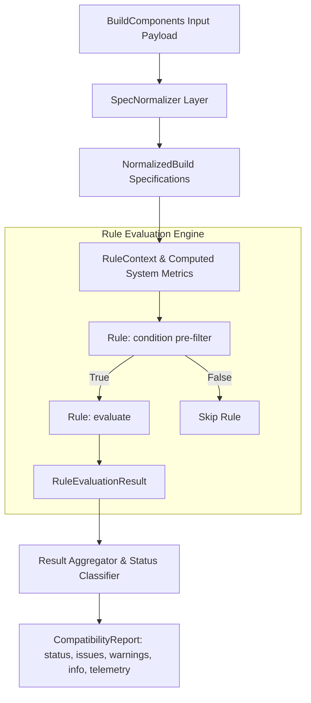

# Hardware Compatibility Engine — PC Platform

> Status: Production Ready | Version: 2.0.0 | Updated: 2026-09  
> Service: `services/compatibility-engine`  
> Port: `:4001` (Internal Microservice)

---

## 1. Executive Summary & Core Principles

The **PC Platform Hardware Compatibility Engine** is an isolated, deterministic microservice dedicated to validating PC hardware configurations. It is designed around three strict engineering principles:

1. **Pure Structured Specifications (No Marketing Name Assumptions)**:  
   Compatibility decisions are never inferred from product marketing titles (e.g., assuming a "Gaming Motherboard" fits a "Gaming Case"). Decisions are evaluated strictly against normalized, typed engineering specifications (socket type, chipset families, physical dimensions in mm, continuous wattage, voltage rails, PCIe electrical lane distribution, and connector pin configurations).

2. **Rules Architecture (`Rule` $\to$ `condition` $\to$ `evaluation` $\to$ `result`)**:  
   Every compatibility rule is an independent, single-responsibility module that encapsulates:
   - `condition(context)`: A high-performance pre-filter determining whether the rule is applicable to the current component configuration.
   - `evaluate(context)`: Pure algorithmic evaluation against structured specifications.
   - `result`: Enriched diagnostic output containing structured severities, categorization, user-friendly explanations, and actionable resolutions.

3. **Logically Independent & Pure Execution**:  
   The engine is stateless and side-effect free. It runs in-memory with sub-millisecond execution times, requiring zero database round-trips during evaluation. It is decoupled from the frontend and e-commerce business logic, allowing autonomous testing, deployment, and scaling.

---

## 2. Architecture & Execution Pipeline



### Deterministic Status Classification

The engine evaluates all issues and classifies the configuration into one of four deterministic statuses:

| Status | Definition | Derivation Rule |
|---|---|---|
| `incompatible` | Build cannot function, will cause physical damage, or will not boot | $\ge 1$ issue with `severity: 'error'` |
| `unknown` | Critical specifications are missing from components, preventing verification | $0$ errors, but $\ge 1$ issue with `severity: 'unknown'` |
| `warning` | System is physically compatible, but operates sub-optimally (e.g. tight PSU headroom, RAM downclocking, missing fan headers) | $0$ errors, $0$ unknowns, but $\ge 1$ issue with `severity: 'warning'` |
| `compatible` | Build is verified fully compatible with all specifications matching | $0$ errors, $0$ warnings, $0$ unknowns |

---

## 3. Enriched Issue Data Model

Every detected issue or advisory returned by the engine adheres to this contract:

```typescript
export interface CompatibilityIssueItem {
  severity: 'error' | 'warning' | 'info' | 'unknown';
  category: CompatibilityCategory; // e.g. SOCKET, MEMORY, POWER, PHYSICAL_CLEARANCE
  title: string;
  explanation: string;
  affectedComponents: string[]; // Product IDs of the conflicting components
  ruleId: string; // e.g. 'cpu-socket', 'gpu-case-length'
  suggestedResolution: string; // Actionable advice to resolve the conflict

  // Backward-compatibility aliases:
  rule?: string;
  message?: string;
  components?: string[];
}
```

---

## 4. Supported Component Inputs

The engine ingests 12 component categories:

1. **CPU**: Socket type, architecture, base TDP, peak TDP (PPT/PL2), supported memory generations, max memory capacity, native memory controller speed, stock cooler inclusion.
2. **Motherboard**: Socket type, chipset, form factor, supported memory types, RAM slots, max RAM capacity, max RAM OC speed, PCIe x16/x4/x1 slots, M.2 slots, M.2 key/bus details, SATA ports, CPU EPS power connectors, fan headers, USB BIOS Flashback support.
3. **CPU Cooler**: Cooler type (Air vs Liquid), supported socket mounting brackets, height (mm), radiator size (mm), TDP dissipation rating (W), fan headers needed.
4. **RAM**: Array of RAM kits: memory type (DDR4/DDR5), total capacity (GB), stick count, speed (MHz), CAS latency.
5. **GPU**: Length (mm), width (mm), slot thickness, TDP (W), recommended PSU wattage (W), required power connectors (16-pin 12VHPWR, 8-pin, 6-pin), required PCIe slot width.
6. **Storage**: Array of SSDs/HDDs: form factor (M.2 2280, 2.5", 3.5"), interface (PCIe 5.0/4.0/3.0 NVMe, SATA III), protocol (NVMe vs SATA), M.2 keying.
7. **PSU**: Continuous wattage, efficiency rating, form factor (ATX, SFX), native 12VHPWR (ATX 3.0), count of 8-pin PCIe cables, count of EPS 12V CPU cables, count of SATA power cables.
8. **Case**: Supported motherboard form factors, max GPU clearance (mm), max CPU cooler clearance (mm), rear expansion PCI bracket slots, radiator mount support positions (top, front, side, bottom).
9. **Fans**: Array of cooling fans: size (mm), quantity, connector type (4-pin PWM, 3-pin).
10. **Expansion Cards**: Array of PCIe add-in cards (sound cards, capture cards, NICs): required PCIe slot width (x1, x4, x8, x16), bracket slot width, power draw.
11. **Monitor**: Display resolution, refresh rate, video input ports (DP, HDMI).
12. **Other Components**: Miscellaneous peripherals and accessories with power draw requirements.

---

## 5. Catalog of All 22 Compatibility Checks

The engine executes 22 checks ordered by evaluation priority:

| # | Rule ID | Category | Description | Severity |
|---|---|---|---|---|
| 1 | `cpu-socket` | `SOCKET` | Validates CPU physical socket type matches motherboard socket (e.g. AM5 $\leftrightarrow$ AM5, LGA1700 $\leftrightarrow$ LGA1700). | `error` / `unknown` |
| 2 | `cpu-chipset` | `CHIPSET` | Validates motherboard chipset platform matches CPU architecture (e.g. AMD X670E for AM5 vs Intel Z790 for LGA1700). | `error` / `unknown` |
| 3 | `ram-generation` | `MEMORY` | Ensures RAM memory generation (DDR4 vs DDR5) is supported by motherboard DIMM slots and CPU memory controller. | `error` / `unknown` |
| 4 | `ram-capacity` | `MEMORY` | Validates total installed RAM capacity (GB) does not exceed motherboard maximum limit and CPU memory controller limit. | `error` / `warning` |
| 5 | `ram-slot-limit` | `MEMORY` | Checks that total physical RAM sticks across all selected kits do not exceed available motherboard DIMM slots. | `error` |
| 6 | `ram-speed` | `MEMORY` | Compares RAM rated transfer rate against motherboard max rated speed (advises of downclocking) and CPU native speed (XMP/EXPO advisory). | `warning` / `info` |
| 7 | `gpu-case-length` | `PHYSICAL_CLEARANCE` | Verifies GPU physical length $\le$ Case max GPU clearance (accounting for front-mounted radiator thickness). | `error` / `warning` |
| 8 | `cooler-case-height` | `PHYSICAL_CLEARANCE` | Verifies air CPU cooler height $\le$ Case side panel cooler clearance. | `error` / `unknown` |
| 9 | `radiator-case-fit` | `COOLING` | Checks that liquid cooler radiator dimensions (120/240/280/360/420mm) can fit in at least one case radiator mount location. | `error` / `info` |
| 10 | `motherboard-case-form-factor` | `PHYSICAL_CLEARANCE` | Validates motherboard form factor fits case standoff patterns (E-ATX, ATX, Micro-ATX, Mini-ITX hierarchy). | `error` / `unknown` |
| 11 | `psu-wattage` | `POWER` | Validates that continuous rated PSU wattage $\ge$ estimated peak system power draw. | `error` / `unknown` |
| 12 | `psu-headroom` | `POWER` | Verifies $\ge 20\%$ safety headroom for transient spikes (load $\le 80\%$) and checks GPU vendor recommended PSU wattage. | `warning` |
| 13 | `psu-gpu-connectors` | `CONNECTORS` | Validates PSU provides required dedicated 8-pin PCIe or native 16-pin 12VHPWR cables for the graphics card. | `error` / `warning` |
| 14 | `storage-interface` | `STORAGE` | Checks that total SATA drive count does not exceed motherboard SATA data ports or PSU SATA power connectors. | `error` |
| 15 | `m2-slot-availability` | `STORAGE` | Checks that total installed M.2 drives do not exceed motherboard physical M.2 sockets. | `error` |
| 16 | `m2-key-interface` | `STORAGE` | Validates electrical protocol (SATA M.2 cannot function in PCIe-only sockets) and warns of PCIe 5.0 SSD bandwidth throttling on PCIe 4.0 slots. | `error` / `warning` |
| 17 | `pcie-slot-requirements` | `EXPANSION` | Ensures motherboard provides sufficient physical/electrical PCIe slots (x16, x4, x1) for GPU and expansion cards. | `error` |
| 18 | `expansion-slot-availability` | `EXPANSION` | Checks total rear expansion bracket thickness (GPU slot width + cards) $\le$ Case rear PCI bracket slots. | `error` |
| 19 | `bios-compatibility` | `BIOS` | Detects CPU release generations newer than motherboard initial chipset manufacturing and verifies USB BIOS Flashback hardware availability. | `warning` / `info` |
| 20 | `fan-connector-availability` | `CONNECTORS` | Compares total fan count needing PWM/DC headers against motherboard fan headers, advising of splitter/hub requirements. | `warning` |
| 21 | `cooling-requirements` | `COOLING` | Checks CPU cooler mounting bracket support for the CPU socket and ensures cooler TDP thermal capacity $\ge$ CPU base and peak TDP. | `error` / `warning` |
| 22 | `motherboard-power-connectors` | `CONNECTORS` | Ensures PSU provides required EPS 12V 8-pin CPU power cables and recommends dual EPS cables for high-wattage CPUs ($>200$W). | `error` / `warning` |

---

## 6. Pre-Computed System Metrics

Before rules are evaluated, `RuleContext` aggregates configuration data into high-precision system telemetry:

```typescript
export interface ComputedMetrics {
  readonly estimatedSystemTdpW: number; // Base platform overhead + CPU peak + GPU peak + RAM + storage + fans + cards
  readonly estimatedTypicalDrawW: number;
  readonly recommendedPsuWattageW: number; // Max of (peak TDP * 1.25 rounded to 50W) or GPU vendor recommendation
  readonly totalRamCapacityGb: number;
  readonly totalRamSticks: number;
  readonly totalM2Drives: number;
  readonly totalSataDrives: number;
  readonly totalFanCount: number;
  readonly totalExpansionCardCount: number;
  readonly totalPciSlotsUsed: number;
  readonly gpuPcie16PinNeeded: number;
  readonly gpuPcie8PinNeeded: number;
  readonly gpuPcie6PinNeeded: number;
  readonly coolerFanHeadersNeeded: number;
}
```

---

## 7. API Specification

### Endpoint

```http
POST /check
Content-Type: application/json
```

### Request Example (`BuildComponents`)

```json
{
  "cpu": {
    "productId": "cpu-7950x",
    "name": "AMD Ryzen 9 7950X",
    "category": "CPU",
    "specs": {
      "socketType": "AM5",
      "tdpW": 170,
      "maxTdpW": 230,
      "memoryType": "DDR5"
    }
  },
  "motherboard": {
    "productId": "mb-z790",
    "name": "MSI MAG Z790 Tomahawk WiFi",
    "category": "MOTHERBOARD",
    "specs": {
      "socketType": "LGA1700",
      "chipset": "Z790",
      "supportedMemTypes": ["DDR5"]
    }
  }
}
```

### Response Example (`CompatibilityResult`)

```json
{
  "status": "incompatible",
  "compatible": false,
  "issues": [
    {
      "severity": "error",
      "category": "SOCKET",
      "ruleId": "cpu-socket",
      "rule": "cpu-socket",
      "title": "CPU and Motherboard Socket Mismatch",
      "explanation": "AMD Ryzen 9 7950X requires socket AM5, but MSI MAG Z790 Tomahawk WiFi features socket LGA1700. The processor cannot physically mount into this motherboard.",
      "message": "AMD Ryzen 9 7950X (AM5) is incompatible with MSI MAG Z790 Tomahawk WiFi (LGA1700).",
      "affectedComponents": ["cpu-7950x", "mb-z790"],
      "components": ["cpu-7950x", "mb-z790"],
      "suggestedResolution": "Choose a motherboard with a AM5 socket, or choose a CPU compatible with LGA1700."
    }
  ],
  "warnings": [],
  "info": [],
  "summary": "Build is incompatible: 1 error(s), 0 warning(s).",
  "telemetry": {
    "evaluatedRulesCount": 3,
    "passedRulesCount": 2,
    "failedRulesCount": 1,
    "warningRulesCount": 0,
    "unknownRulesCount": 0,
    "executionTimeMs": 1
  }
}
```

---

## 8. Test Suite & Independent Testability

The service contains extensive unit and integration tests located in `services/compatibility-engine/test/`:

- `test/fixtures/compatible-builds.fixture.ts`: Flagship AM5, Intel Liquid-Cooled, and Budget Micro-ATX builds.
- `test/fixtures/incompatible-builds.fixture.ts`: Test cases triggering each of the 22 error conditions.
- `test/fixtures/borderline-builds.fixture.ts`: Transient headroom, downclocking, fan splitter, and BIOS update advisories.
- `test/fixtures/missing-data-builds.fixture.ts`: Validation of graceful degradation into `unknown` status when specifications are omitted.
- `test/compatibility-engine.spec.ts`: End-to-end service test suite verifying all 22 rules, precedence resolution, and telemetry.
- `test/spec-normalizer.spec.ts`: Unit tests validating unit conversion and string parsing.
- `test/compatibility.controller.spec.ts`: NestJS Controller unit tests.

### Running Tests

```bash
# Run Jest test suite
pnpm --filter @pc-platform/compatibility-engine test

# Run test coverage
pnpm --filter @pc-platform/compatibility-engine run test:coverage

# TypeScript compile validation
pnpm --filter @pc-platform/compatibility-engine typecheck
```

---

## 9. Module Reference Specification

| Dimension | Specification |
|---|---|
| **Purpose** | Pure deterministic hardware compatibility evaluation engine for custom PC configurations. |
| **Responsibilities** | Socket matching, physical clearance checks, power & wattage draw calculation, bus/connector availability validation. |
| **Inputs** | `BuildComponents` JSON object containing normalized specifications of selected components (CPU, GPU, Motherboard, etc.). |
| **Outputs** | `CompatibilityReport`: status (`compatible`, `warning`, `incompatible`, `unknown`), detailed list of issues and suggested resolutions. |
| **Dependencies** | `@pc-platform/types`, `@nestjs/common`. **Zero database or external network dependencies.** |
| **API Endpoints** | `POST /api/v1/compatibility/validate` (invoked internally or via API gateway). |
| **Database Tables** | **NONE (Zero Database Access).** The engine is 100% stateless and in-memory. |
| **Failure Modes** | Missing component specs (returns `unknown` status with advisory), malformed JSON input (returns `400 Bad Request`). |
| **Testing Approach** | Exhaustive unit tests with fixtures in `services/compatibility-engine/test/` verifying all 22 rules and edge cases. |
| **How to Modify Safely**| Implement `CompatibilityRule` in `src/rules/`, register in `src/rules/index.ts`, and add fixture tests in `test/`. See [How-To Change Compatibility Rule](../how-to/change-compatibility-rule.md). |

